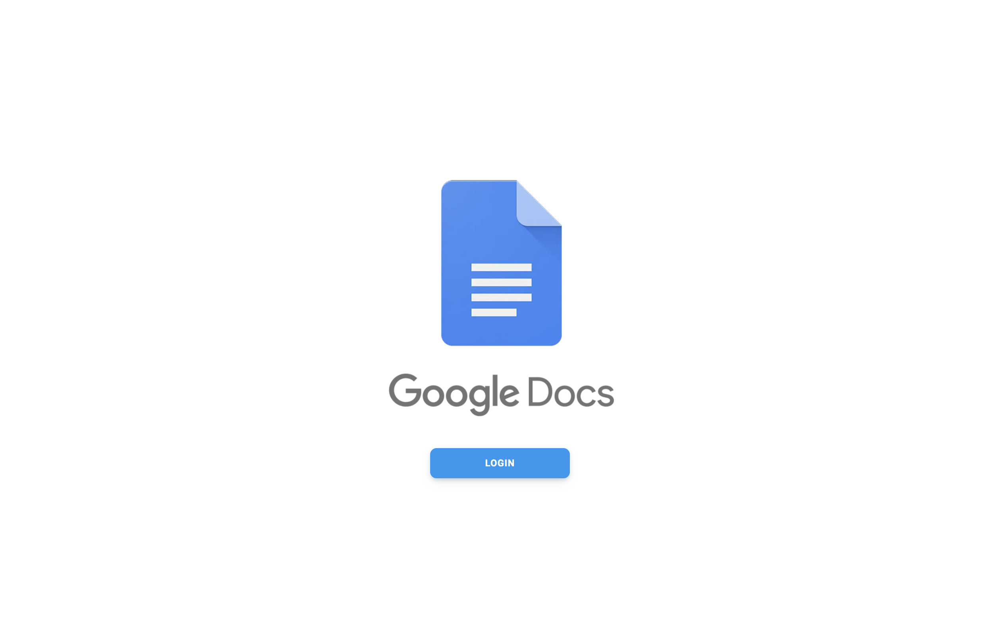
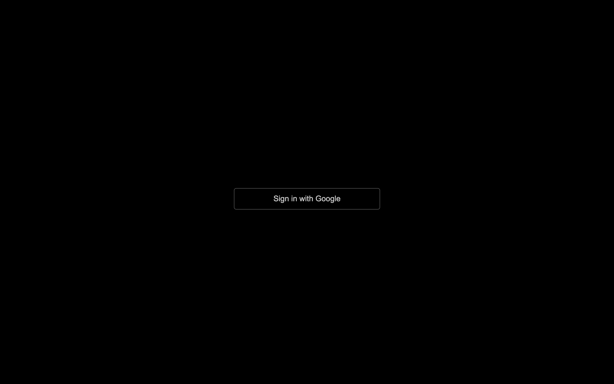
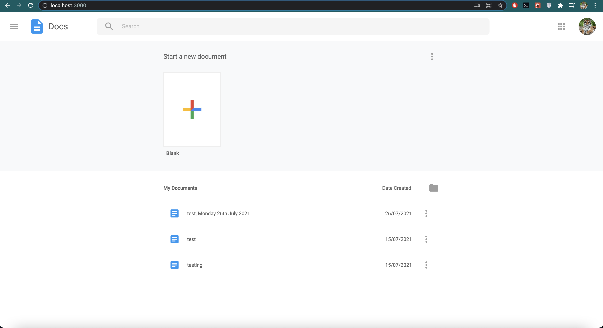
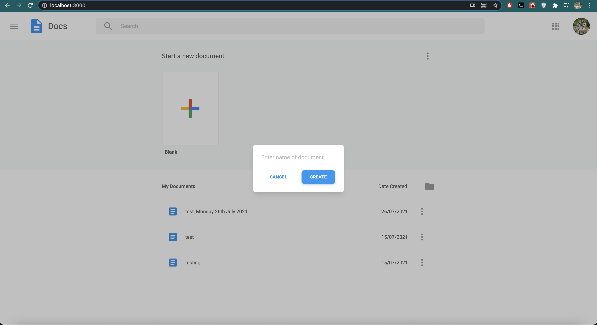
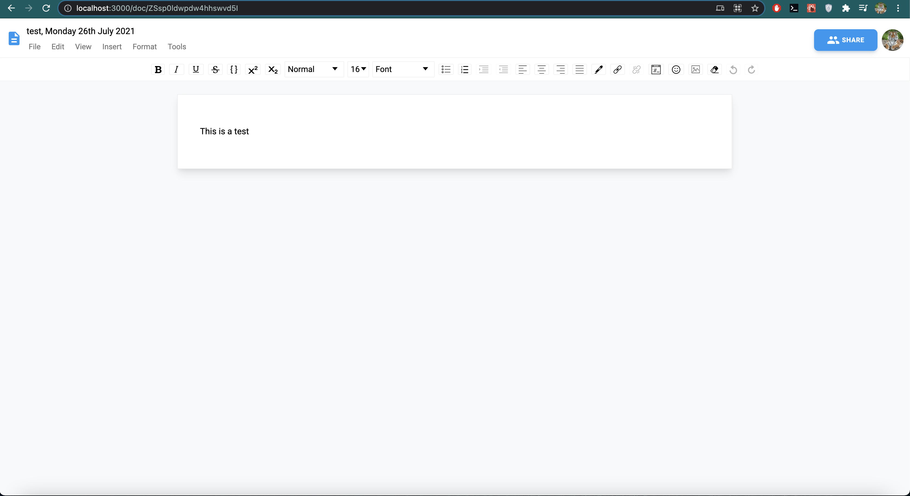
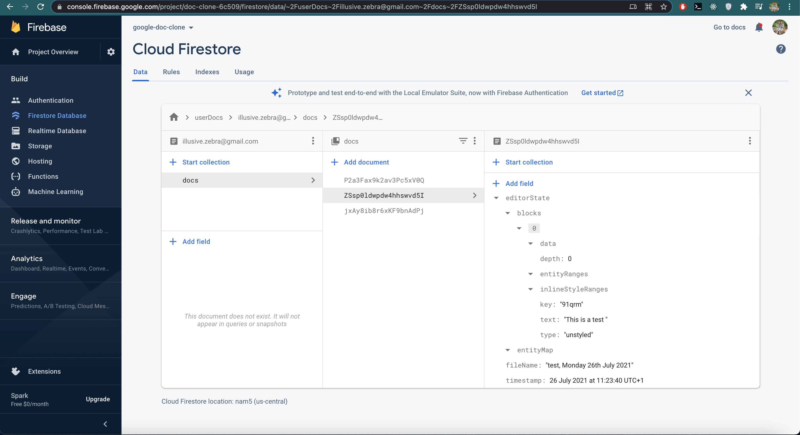

# Google Docs Clone

Built using:

- Next.js
- React.js
- Draft.js
- Tailwind CSS
- Material UI
- Firebase, Firestore
- Next Auth

## Features and functionality

- Login with your google account
- Create new documents
- Edit exisiting documents
- Sign out

## Screenshots

1. Login Page

2. Login with Google Account

3. Dashboard

4. Create New File

5. Editing File

6. Firestore Database

